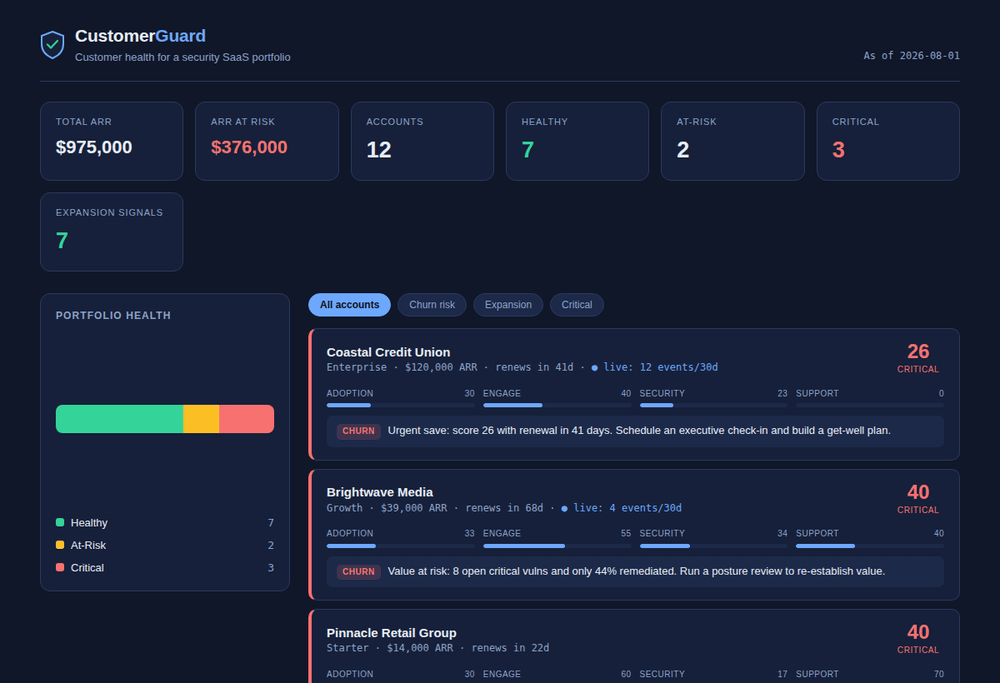

# CustomerGuard

A customer health dashboard for a security SaaS, modeling the account-health analysis a Technical Account Manager or Customer Success Manager runs on their book of business.

Given a portfolio of customer accounts, CustomerGuard scores each account's health from weighted usage and security signals, flags churn risks and expansion opportunities, and turns each into a plain-English recommended action, then presents it all in a web dashboard and an exportable spreadsheet.

> **Context:** This is an applied project I built with AI-assisted development to model a real customer-success workflow. The account data is synthetic by design, so the focus stays on the health-scoring logic and the integration, not on any real customer data. It is a learning-and-portfolio project, not production software.

## Why I built it

I spent 10+ years in B2B SaaS owning customer relationships, onboarding, adoption, renewals, and expansion, and I am moving into technical customer success and technical account management. Those roles run on exactly this analysis: watch account health, catch churn risk early, spot expansion, and know what to do about each. I built CustomerGuard to model that workflow end to end and to keep sharpening my applied technical skills (Python, REST APIs, and building with AI-assisted tools).



## What it does

- **Scores account health (0-100)** from four weighted sub-scores, each encoding a point of view about what predicts retention for a security SaaS.
- **Flags churn risk and expansion opportunities**, and writes a specific recommended action for each account (for example, an urgent save motion for a low-scoring account near renewal, or a seat-upsell nudge for a healthy, high-utilization account).
- **Pulls a live signal from the GitHub REST API** as a real external-integration touchpoint, folded into each account's view.
- **Presents two views:** an interactive web dashboard and a two-tab Excel workbook (summary + full signal detail).

## The health model

Health is a weighted blend of four sub-scores, each normalized to 0-100:

| Sub-score | Weight | What it captures |
|---|---|---|
| Adoption | 35% | Active vs. licensed seats, the strongest leading indicator in seat-based SaaS |
| Engagement | 25% | Logins and product usage (scans) per active seat |
| Security Outcome | 25% | Are they getting value? Remediation rate and open critical-vulnerability exposure |
| Support Signal | 15% | Excessive support tickets as a friction signal |

The weights are deliberate opinions, not ground truth. With real renewal history I would calibrate them against actual churn outcomes; the model is written to be transparent so the reasoning is easy to inspect and adjust.

Accounts resolve to a status: **Healthy** (75+), **At-Risk** (50-74), or **Critical** (under 50), and the dashboard sorts worst-first so the highest-priority accounts surface immediately.

## Architecture

```
health_model.py      Scoring engine: defines the accounts, computes sub-scores,
                     the total score, flags, and recommended actions.
                     Writes accounts.json.
        |
        v
github_signal.py     Pulls a live signal (recent commit activity) from the
                     GitHub REST API and enriches the accounts. Degrades
                     gracefully on rate limits or network failure.
        |
        v
accounts.json        The data handoff artifact.
        |
        +--> dashboard.html               Self-contained web dashboard (opens in any browser).
        +--> make_spreadsheet.py          Builds the two-tab Excel demo workbook.
```

This mirrors how these signals actually flow in a CS tool: a scoring layer, an integration layer, a clean data artifact, and presentation on top.

## Running it

Requires Python 3.9+. The dashboard needs no build step or server.

```bash
# 1. Score the portfolio (writes accounts.json)
python health_model.py

# 2. (Optional) pull the live GitHub signal
#    Unauthenticated works but hits a low rate limit; a token raises it.
python github_signal.py
GITHUB_TOKEN=your_token python github_signal.py   # higher rate limit

# 3. Build the Excel demo workbook (needs openpyxl)
python make_spreadsheet.py

# 4. Open the dashboard
open dashboard.html          # or just double-click it
```

`dashboard.html` is fully self-contained: the account data is embedded, so it works offline. The portfolio donut chart loads Chart.js from a CDN and falls back to a simple bar if offline.

## Notes on the API integration

`github_signal.py` maps each demo account to a public GitHub repository standing in for the customer's "monitored environment," then reads public commit metadata as a live activity signal. It never hard-codes a token (it reads `GITHUB_TOKEN` from the environment only), sets a timeout, and returns cleanly on rate limits, timeouts, or 404s so a third-party outage never breaks the tool. That graceful-degradation posture is deliberate: a customer-facing tool should not fall over because an upstream API is slow.

## Tech

Python (standard library plus `openpyxl` for the workbook), a single-file HTML/CSS/JavaScript dashboard, Chart.js for the one chart, and the GitHub REST API. Built with AI-assisted development.

## What I would add next

- Calibrate the scoring weights against real (or realistic simulated) renewal outcomes.
- Add trend tracking (health over time) rather than a single snapshot.
- Pull more integration signals (support-ticket systems, product analytics) behind the same enrichment pattern.
